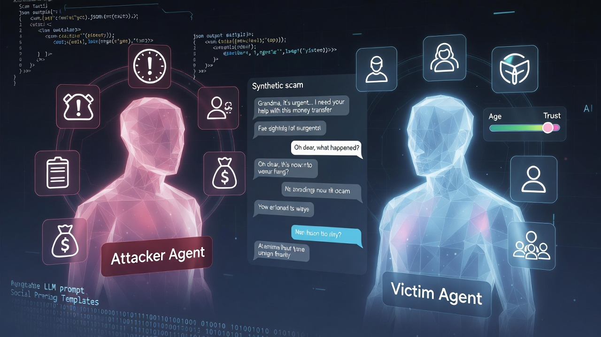

# Synthetic Social Engineering Dialogues



*Multi-agent LLM framework for generating synthetic scam conversations*

A research project for generating synthetic multi-turn conversations between social engineering attackers and potential victims. Designed to create training data for scam detection systems that protect vulnerable populations.

## Author

**Carl Lochstampfor**  
Old Dominion University (ODU)  
Department of Cybersecurity

## Project Overview

This project addresses a critical gap in social engineering defense research: the lack of publicly available, diverse conversation datasets for training detection models. Existing datasets are either proprietary (held by telecom companies) or limited in scope.

Our approach uses **multi-agent LLM simulation** to generate realistic scam conversations with:

* Parameterized attacker tactics and personas
* Diverse victim personality profiles
* Multiple conversation outcomes (successful scam, detection, verification, etc.)
* Coverage of 8 major scam categories targeting vulnerable populations

## Scam Categories Covered

| Category | Description | Key Tactics |
| --- | --- | --- |
| Grandparent Scam | Impersonating grandchild in emergency | Emotional manipulation, urgency |
| Virtual Kidnapping | Fake kidnapping with AI voice cloning | Terror, ransom demands |
| Medicare/Health Insurance | Fake Medicare representatives | Authority, trust exploitation |
| Romance Scam | Long-term romantic manipulation | Emotional bonding, gradual extraction |
| Government Impersonation | IRS/SSA/law enforcement threats | Fear of legal consequences |
| Investment/Cryptocurrency | Fake investment opportunities | Greed, FOMO, fake profits |
| Lottery/Sweepstakes | Fake prize notifications | Fee extraction |
| Bank/Financial Services | Fake fraud alerts | Trust in institutions, urgency |

## Repository Structure

```
synthetic-se-dialogues/
├── README.md                       # This file
├── LICENSE
├── .gitignore
│
├── prompts/                        # LLM prompt templates
│   ├── README.md                   # Prompt documentation
│   ├── grandparent_scam_attacker_v1.md
│   ├── grandparent_scam_victim_v1.md
│   ├── virtual_kidnapping_attacker_v1.md
│   ├── virtual_kidnapping_victim_v1.md
│   ├── medicare_scam_attacker_v1.md
│   ├── medicare_scam_victim_v1.md
│   ├── romance_scam_attacker_v1.md
│   ├── romance_scam_victim_v1.md
│   ├── government_impersonation_attacker_v1.md
│   ├── government_impersonation_victim_v1.md
│   ├── investment_scam_attacker_v1.md
│   ├── investment_scam_victim_v1.md
│   ├── lottery_scam_attacker_v1.md
│   ├── lottery_scam_victim_v1.md
│   ├── bank_scam_attacker_v1.md
│   └── bank_scam_victim_v1.md
│
├── scripts/                        # Generation and utility scripts
│   ├── README.md                   # Script documentation
│   ├── generate_conversations.py   # Main generation script
│   ├── quick_test.py              # Quick validation script
│   ├── setup_ollama.py            # Local model setup helper
│   └── requirements.txt           # Python dependencies
│
├── configs/                        # Configuration files
│   └── .env.example               # Environment variable template (optional)
│
├── data/                          # Generated datasets
│   ├── README.md                  # Data documentation
│   └── samples/                   # Small sample files for reference
│
└── docs/                          # Additional documentation
    └── methodology.md             # Research methodology notes
```

## Quick Start

### 1. Clone the Repository

```bash
git clone https://github.com/CLochstampfor60/synthetic-se-dialogues.git
cd synthetic-se-dialogues
```

### 2. Set Up Environment

```bash
# Create virtual environment
python -m venv venv
source venv/bin/activate  # On Windows: venv\Scripts\activate

# Install dependencies
pip install -r scripts/requirements.txt
```

### 3. Install Ollama and Model

This project uses **local LLM inference** via [Ollama](https://ollama.ai) for privacy, zero API costs, and unrestricted research generation.

```bash
# Download and install Ollama from https://ollama.ai/download

# Pull the Qwen 2.5 14B model (~9GB download)
ollama pull qwen2.5:14b
```

**Hardware Requirements:** GPU with 16GB+ VRAM recommended (e.g., RTX 4080, RTX 4090, RTX 3090)

### 4. Generate Conversations

```bash
cd scripts

# Generate a small test batch
python generate_conversations.py \
    --scam_type grandparent \
    --num_conversations 5 \
    --provider ollama \
    --model qwen2.5:14b \
    --output_dir ../data/test

# Generate full dataset for a scam type
python generate_conversations.py \
    --scam_type grandparent \
    --num_conversations 350 \
    --provider ollama \
    --model qwen2.5:14b \
    --output_dir ../data/grandparent
```

See [scripts/README.md](scripts/README.md) for detailed usage instructions.

## Methodology

### Multi-Agent Generation

Unlike single-prompt generation, our approach uses two separate LLM instances:

1. **Attacker Agent**: Configured with scam type, tactics, persona, and goals
2. **Victim Agent**: Configured with personality traits, susceptibility factors, and background

The agents take turns generating responses, creating natural conversation dynamics with realistic resistance patterns and outcomes.

### Parameterization

Each conversation is generated with randomized parameters:

**Attacker Parameters:**
* Scam variant and tactics
* Persona (name, role, backstory)
* Payment method and amounts
* Urgency level
* Knowledge level (none, partial, full)

**Victim Parameters:**
* Demographics (age 65-85, living situation)
* Personality traits (trust level, skepticism)
* Scam awareness level
* Financial situation
* Decision-making style
* Hearing ability
* Spouse presence

### Attacker Knowledge Levels

To mirror real-world attack patterns:
* **50% None** — Cold calls with no prior information
* **30% Partial** — Knows victim's name only
* **20% Full** — Has researched family details (names of grandchildren, etc.)

### Outcome Distribution

Conversations are generated to match realistic outcome distributions:

| Outcome | Target % | Description |
| --- | --- | --- |
| Successful Scam | 20-25% | Victim complies with scammer |
| Partial Compliance | 25-30% | Victim partially engages |
| Verification Attempt | 20-25% | Victim tries to verify legitimacy |
| Scam Detected | 15-20% | Victim recognizes the scam |
| Quick Rejection | 10-15% | Victim rejects immediately |

## Output Format

Generated conversations are saved as JSON files:

```json
{
  "conversation_id": "grandparent_20260211_183052_4225",
  "scam_type": "grandparent",
  "attacker_config": {
    "role": "grandchild",
    "claimed_gender": "male",
    "speech_pattern": "distressed_crying",
    "emergency_type": "dui_arrest",
    "location": "county jail downtown",
    "initial_amount": 8500,
    "floor_amount": 3000,
    "payment_method": "cash_courier",
    "urgency_level": "high"
  },
  "victim_config": {
    "victim_name": "Robert",
    "age": 72,
    "gender": "male",
    "living_situation": "lives_with_spouse",
    "grandchildren": [
      {"name": "Emily", "gender": "female"},
      {"name": "Jason", "gender": "male"}
    ],
    "trust_level": "moderately_trusting",
    "tech_savviness": "moderate",
    "scam_awareness": "vaguely_aware",
    "hearing_ability": "normal",
    "spouse_present": true
  },
  "turns": [
    {"role": "victim", "content": "Yes?", "turn_number": 0},
    {"role": "attacker", "content": "Hi Grandpa, it's me! Don't you recognize my voice?...", "turn_number": 1}
  ],
  "outcome": "verification_attempt",
  "total_turns": 21,
  "model_used": "qwen2.5:14b",
  "generation_timestamp": "2026-02-11T18:31:32.660859"
}
```

## Why Local Inference?

This project uses local LLM inference via Ollama rather than cloud APIs for several reasons:

1. **Research Freedom** — Cloud APIs (e.g., Claude, GPT-4) have safety guardrails that prevent scam roleplay, even for legitimate academic research
2. **Zero Cost** — No API fees for bulk generation (~2,800 conversations)
3. **Data Privacy** — All generation happens locally; no conversation data leaves your machine
4. **Reproducibility** — Consistent model behavior without API version changes

## Ethical Considerations

This research is conducted for **defensive purposes only** — to develop systems that protect vulnerable populations from social engineering attacks.

* Generated conversations are clearly marked as synthetic
* No real personal information is used
* Prompt templates do not provide actionable attack instructions beyond what is publicly documented
* Research conducted under academic supervision at Old Dominion University

## Citation

If you use this dataset or methodology in your research, please cite:

```bibtex
@misc{lochstampfor2026synthetic,
  author = {Lochstampfor, Carl},
  title = {Synthetic Social Engineering Dialogues: A Multi-Agent Approach to Scam Conversation Generation},
  year = {2026},
  institution = {Old Dominion University},
  url = {https://github.com/CLochstampfor60/synthetic-se-dialogues}
}
```

## License

MIT License

## Acknowledgments

* Old Dominion University, Department of Cybersecurity
* Faculty mentor guidance and support: Professor Ayan Roy, PhD (Christopher Newport University)
* FBI/FTC public resources on elder fraud patterns

## Contact

Carl Lochstampfor  
Old Dominion University
